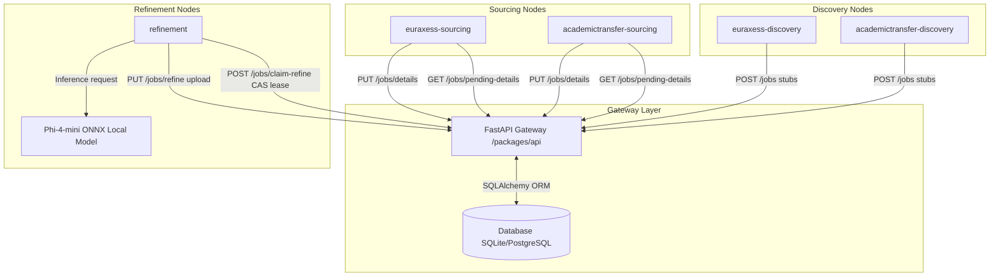

# Distributed Job Sourcing & Refinement Pipeline

A decoupled, cloud-ready multi-agent workspace monorepo utilizing **`uv` workspaces**, **FastAPI**, and **ONNX local LLM models** to source, index, and refine academic listings.

---

## 1. Project Directory Structure

```text
├── packages/
│   ├── core/                          # Database, models, and shared utilities
│   ├── api/                           # FastAPI gateway application
│   └── agents/                        # Folder containing all agent packages
│       ├── euraxess-discovery/            # EURAXESS listing discovery worker
│       ├── euraxess-sourcing/             # EURAXESS detail sourcing worker
│       ├── academictransfer-discovery/    # AcademicTransfer listing discovery worker
│       ├── academictransfer-sourcing/     # AcademicTransfer detail sourcing worker
│       └── refinement/                    # Local ONNX metadata refinement worker
├── pyproject.toml                     # Root workspace settings
├── uv.lock                           # Resolved monorepo lockfile
├── .env.example                       # Configuration variable template
└── Dockerfile                         # Unified container entrypoint
```

---

## 2. System Requirements

*   **Python**: Version `>= 3.11`
*   **Environment Manager**: [uv](https://github.com/astral-sh/uv) (strongly recommended for fast, frozen workspace synchronization)
*   **Hardware (Local LLM Refinement)**:
    *   Minimum **3GB RAM / VRAM** allocated to run the quantized `phi-4-mini` ONNX model.
    *   An SSD is strongly recommended to reduce model loading time on startup.
*   **Database**: SQLite (default local file `jobs.db`), or PostgreSQL (Neon Serverless Postgres recommended for staging/production).

---

## 3. Quick Start

### A. Setup Environment Configuration
Create a local `.env` file from the example template:
```bash
cp .env.example .env
```
Configure your credentials, database connection strings, and model parameters inside the newly created `.env` file.

### B. Resolve Dependencies
Synchronize the monorepo workspace dependencies:
```bash
uv sync --all-packages
```

### C. Start the Central API Gateway
Run the FastAPI production-grade server:
```bash
uv run --package api fastapi run packages/api/src/api/main.py --port 8000
```

---

## 4. Running Workspace Agents

All agents reside in the `packages/agents/` folder and run using the same unified command syntax. The local `.env` configuration file is automatically loaded at runtime.

### Workspace Agents Catalog

| Agent Package | Main Module | Agent Role | Target Source |
| :--- | :--- | :--- | :--- |
| `euraxess-discovery` | `euraxess_discovery.main` | Discovery (Listing Search) | EURAXESS |
| `academictransfer-discovery` | `academictransfer_discovery.main` | Discovery (Listing Search) | AcademicTransfer |
| `euraxess-sourcing` | `euraxess_sourcing.main` | Sourcing (Detail Pages) | EURAXESS |
| `academictransfer-sourcing` | `academictransfer_sourcing.main` | Sourcing (Detail Pages) | AcademicTransfer |
| `refinement` | `agent_refinement.main` | Refinement (Metadata Extraction) | (All Sources) |

### Generic Running Syntax
To execute any agent from the workspace root:
```bash
uv run --package <Agent Package> python -m <Main Module>
```

*Example for running the EURAXESS Listing Discovery agent:*
```bash
uv run --package euraxess-discovery python -m euraxess_discovery.main
```

---

## 5. Configuration Parameters

The components are configured via `.env` file variables:

| Environment Variable | Default Value | Description |
|---|---|---|
| `API_URL` | `http://localhost:8000` | Target URL of the FastAPI gateway |
| `API_TOKEN` | *None* | Bearer credential token |
| `API_SECRET_KEY` | *None* | Shared validation key (API Server only) |
| `DATABASE_URL` | `sqlite:///jobs.db` | SQL database connection string |
| `MAX_PAGES` | `5` | Pagination crawl depth |
| `MODEL_PATH` | `phi-4-mini-onnx/...` | Relative path to local ONNX model directory |
| `MAX_LENGTH` | `4096` | LLM maximum generation length |
| `TEMPERATURE` | `0.0` | Model generation temperature |
| `MAX_TEXT_CHARS` | `3000` | Max characters sent to context window |
| `AGENT_NAME` | `refinement-worker` | Custom agent identifier for locking |

---

## 6. Architecture & System Diagrams

### System Architecture
The pipeline is designed as an API-first distributed monorepo. Discovery, sourcing, and refinement agents are fully decoupled and communicate solely through the FastAPI gateway server.



### Class Structures
The domain abstractions and schemas reside in the core package, ensuring identical validation boundaries across the API and external agents.

```mermaid
classDiagram
    class BaseHttpClient {
        <<Interface>>
        +fetch(url: str)* bytes
        +close()* void
    }
    class HttpClient {
        +fetch(url: str) bytes
        +close() void
    }
    class BaseDiscovery {
        <<Abstract>>
        +http_client: BaseHttpClient
        +max_pages: int
        +search_all(known_urls: set) list
        #_build_browse_url(page: int)* str
        #_parse_search_page(html_content: str)* list
    }
    class BaseSourcing {
        <<Abstract>>
        +http_client: BaseHttpClient
        +source_detail(url: str) JobDetailUpdate
        #_parse_detail_page(html_content: str, url: str)* JobDetailUpdate
    }
    class EuraxessDiscovery {
        +SOURCE_NAME: str
        #_build_browse_url(page: int) str
        #_parse_search_page(html_content: str) list
    }
    class EuraxessSourcing {
        +SOURCE_NAME: str
        #_parse_detail_page(html_content: str, url: str) JobDetailUpdate
    }
    class AcademicTransferDiscovery {
        +SOURCE_NAME: str
        #_build_browse_url(page: int) str
        #_parse_search_page(html_content: str) list
    }
    class AcademicTransferSourcing {
        +SOURCE_NAME: str
        #_parse_detail_page(html_content: str, url: str) JobDetailUpdate
    }
    class BaseRefiner {
        <<Abstract>>
        +refine(url: str, title: str, description: str, requirements: str)* RefinementResult
    }
    class LlmRefiner {
        -_system_prompt: str
        -_model_path: str
        +load_model() void
        +refine(url: str, title: str, description: str, requirements: str) RefinementResult
    }
    class DatabaseJobRepository {
        -_SessionLocal: sessionmaker
        +save(jobs: list) void
        +claim_next_for_refinement(agent_name: str) Job
        +complete_refinement(url: str, required_skills: list, education_level: str) void
        +fail_refinement(url: str) void
    }
    class Job {
        +title: str
        +url: str
        +source: str
        +deadline: str
        +employer: str
        +location: str
        +description: str
        +requirements: str
        +required_skills: list
        +education_level: str
    }

    BaseHttpClient <|-- HttpClient
    BaseDiscovery ..> BaseHttpClient : Uses
    BaseSourcing ..> BaseHttpClient : Uses
    BaseDiscovery <|-- EuraxessDiscovery
    BaseDiscovery <|-- AcademicTransferDiscovery
    BaseSourcing <|-- EuraxessSourcing
    BaseSourcing <|-- AcademicTransferSourcing
    BaseRefiner <|-- LlmRefiner
    DatabaseJobRepository ..> Job : Manages
    EuraxessSourcing ..> Job : Sources Details
    AcademicTransferSourcing ..> Job : Sources Details
    LlmRefiner ..> Job : Refines
```


