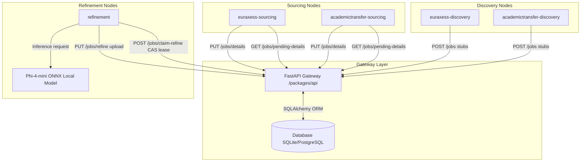
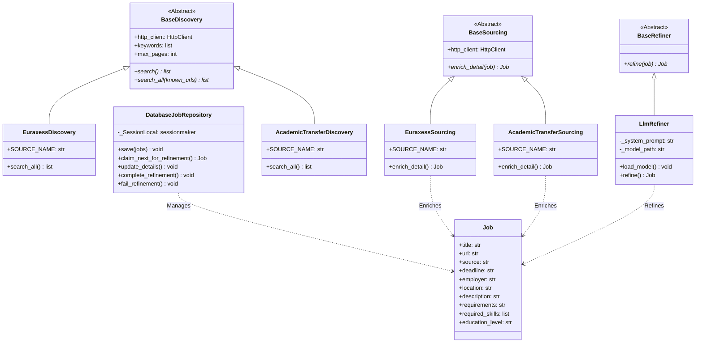

# Distributed Job Sourcing & Refinement Pipeline

A decoupled, cloud-ready multi-agent workspace monorepo utilizing **`uv` workspaces**, **FastAPI**, and **ONNX local LLM models** to source, index, and refine academic listings.

---

## 1. Project Directory Structure

```text
├── packages/
│   ├── core/                          # Database, models, and shared utilities
│   ├── api/                           # FastAPI gateway application
│   └── agents/                        # Folder containing all agent packages
│       ├── euraxess-discovery/            # EURAXESS listing discovery worker
│       ├── euraxess-sourcing/             # EURAXESS detail sourcing worker
│       ├── academictransfer-discovery/    # AcademicTransfer listing discovery worker
│       ├── academictransfer-sourcing/     # AcademicTransfer detail sourcing worker
│       └── refinement/                    # Local ONNX metadata refinement worker
├── pyproject.toml                     # Root workspace settings
├── uv.lock                           # Resolved monorepo lockfile
├── .env.example                       # Configuration variable template
└── Dockerfile                         # Unified container entrypoint
```

---

## 2. Quick Start

### A. Setup Environment Configuration
Create a local `.env` file from the example template:
```bash
cp .env.example .env
```
Open `.env` and configure your credentials and database configurations.

### B. Resolve Dependencies
Make sure you have `uv` installed, then synchronize the workspace:
```bash
uv sync
```

### C. Start the Central API Gateway
Run the FastAPI production-grade server:
```bash
uv run --package api fastapi run packages/api/src/api/main.py --port 8000
```

### D. Run Discovery Agents
Discovery agents paginate search result pages and register new job stubs to the API:
```bash
# Discover EURAXESS listings
uv run --package euraxess-discovery python -m euraxess_discovery.main

# Discover AcademicTransfer listings
uv run --package academictransfer-discovery python -m academictransfer_discovery.main
```

### E. Run Detail Sourcing Agents
Sourcing agents claim pending stubs, fetch full detail pages, and upload descriptions:
```bash
# Source EURAXESS details
uv run --package euraxess-sourcing python -m euraxess_sourcing.main

# Source AcademicTransfer details
uv run --package academictransfer-sourcing python -m academictransfer_sourcing.main
```

### F. Run Parallel Refinement Agents
Refinement agents claim jobs atomically using Compare-and-Swap (CAS), run local Phi-4-mini ONNX model inferences, and upload results. You can spin up multiple parallel instances:
```bash
# Run worker 1
uv run --package refinement python -m agent_refinement.main --name worker_1

# Run worker 2
uv run --package refinement python -m agent_refinement.main --name worker_2
```

---

## 3. Configuration Parameters

The components are configured via `.env` file variables:

| Environment Variable | Default Value | Description |
|---|---|---|
| `API_URL` | `http://localhost:8000` | Target URL of the FastAPI gateway |
| `API_TOKEN` | *None* | Bearer credential token |
| `API_SECRET_KEY` | *None* | Shared validation key (API Server only) |
| `DATABASE_URL` | `sqlite:///jobs.db` | SQL database connection string |
| `MAX_PAGES` | `5` | Pagination crawl depth |
| `MODEL_PATH` | `phi-4-mini-onnx/...` | Relative path to local ONNX model directory |
| `MAX_LENGTH` | `4096` | LLM maximum generation length |
| `TEMPERATURE` | `0.0` | Model generation temperature |
| `MAX_TEXT_CHARS` | `3000` | Max characters sent to context window |
| `AGENT_NAME` | `refinement-worker` | Custom agent identifier for locking |

---

## 4. Architecture & System Diagrams

### System Architecture
The pipeline is designed as an API-first distributed monorepo. Discovery, sourcing, and refinement agents are fully decoupled and communicate solely through the FastAPI gateway server.



### Class Structures
The domain abstractions and schemas reside in the core package, ensuring identical validation boundaries across the API and external agents.


