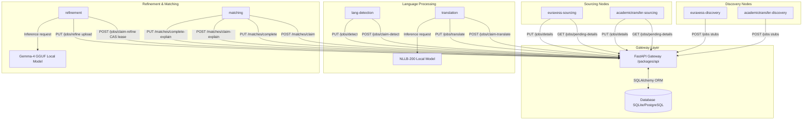

# Academic Job Sourcing & Refinement

Automated academic job sourcing, metadata refinement, and CV matching pipeline. Uses local, CPU-optimized models (Gemma-4, SentenceTransformers, and NLLB-200) to translate, detect languages, extract structured skills, prerequisite degrees, and match candidates against positions.

---

## 1. Project Structure

```text
├── packages/
│   ├── core/                          # Shared domain models, DB repositories, and SDK utilities
│   │   └── src/core/utils/agent.py    # Standardized signal-aware agent loop utility
│   ├── api/                           # FastAPI gateway server and database coordinator
│   └── agents/                        # Isolated worker packages running in parallel
│       ├── euraxess-discovery/            # EURAXESS search pagination discovery agent
│       ├── euraxess-sourcing/             # EURAXESS page details fetcher agent
│       ├── academictransfer-discovery/    # AcademicTransfer search pagination discovery agent
│       ├── academictransfer-sourcing/     # AcademicTransfer page details fetcher agent
│       ├── lang-detection/                # Standalone local language detection agent
│       ├── translation/                   # Standalone local NLLB-200 translation agent
│       ├── refinement/                    # Local Gemma-4 metadata extractor & refiner agent
│       ├── matching/                      # Candidate CV matching & LLM explanation agent
│       └── cv-parsing/                    # Background CV parsing, translation, and structured LLM extraction agent
├── pyproject.toml                     # Root workspace configuration
├── uv.lock                           # Workspace dependency lockfile
├── .env.example                       # Settings template file
├── Dockerfile                         # Unified multi-purpose Dockerfile
└── docker-compose.yml                 # Unified Docker Compose orchestration config
```

---

## 2. Requirements

*   **Docker & Docker Compose** (highly recommended for unified execution)
*   **Python**: `>= 3.12` (if running locally without containers)
*   **Environment Manager**: [uv](https://github.com/astral-sh/uv) (for local CLI runs)
*   **Hardware requirements**:
    *   **Refinement Agent**: ~2.8GB RAM to load the `gemma-4-E2B-it-Q4_K_M` GGUF model via llama-cpp-python (idle RAM drops to ~40MB with auto-unload).
    *   **Translation Agent**: ~600MB RAM to load the quantized `NLLB-200-distilled-600M` model.
    *   **Matching Agent**: Loads the `Gemma-4` GGUF explainer model on demand and uses `nomic-embed-text-v1.5` for candidate matching.
*   **Database**: SQLite (default local file `jobs.db` mounted in containers) or PostgreSQL.

---

## 3. Quick Start with Docker Compose (Recommended)

Running the entire stack (API server + crawlers + NLP workers) takes a single command:

### A. Configure Environment
Create your local `.env` file from the template:
```bash
cp .env.example .env
```
Edit `.env` to verify your variables.

### B. Boot the Stack

You can run the stack in two modes:

#### 1. Local Development Mode (Exposes API directly to port 8000)
Simply run:
```bash
docker compose up --build -d
```
This automatically merges `docker-compose.yml` and `docker-compose.override.yml`, mapping the `api` service directly to host port `8000`.

#### 2. Production Scaled Mode (Behind NGINX Load Balancer)
To test or deploy in production topology with scaled API server instances:
```bash
docker compose -f docker-compose.yml -f docker-compose.prod.yml up --build -d --scale api=3
```
This launches 3 independent stateless API server containers and puts an **NGINX Reverse Proxy** load balancer in front of them, mapping host port `8000` to distribute traffic dynamically across the API replicas.

### C. Graceful Terminations
To stop the stack cleanly:
```bash
docker compose down
```
All containers intercept the `SIGTERM` signal, executing graceful SDK cleanup steps (releasing database locks, deallocating LLM models) in milliseconds.

---

## 4. Running Locally with UV (Development Mode)

If you prefer to run services manually without Docker, synchronize your dependencies first:
```bash
uv sync --all-packages
```

### A. Start API Server
Run the FastAPI gateway server:
```bash
uv run --package api fastapi run packages/api/src/api/main.py --port 8000
```

### B. Run Workspace Agents
All agents are run from the workspace root. Settings are loaded automatically from your `.env` file.

| Agent Package | Main Module | Agent Role |
| :--- | :--- | :--- |
| `euraxess-discovery` | `euraxess_discovery.main` | Pagination crawl discovery (EURAXESS) |
| `academictransfer-discovery` | `academictransfer_discovery.main` | Pagination crawl discovery (AcademicTransfer) |
| `euraxess-sourcing` | `euraxess_sourcing.main` | Page details fetcher (EURAXESS) |
| `academictransfer-sourcing` | `academictransfer_sourcing.main` | Page details fetcher (AcademicTransfer) |
| `lang-detection` | `agent_lang_detection.main` | Language Detection (All Sources) |
| `translation` | `agent_translation.main` | Local NLLB-200 Translation (All Sources) |
| `refinement` | `agent_refinement.main` | Gemma-4 Skills Extraction (All Sources) |
| `matching` | `agent_matching.main` | Candidate CV Matcher & Explainer (All Sources) |
| `cv-parsing` | `agent_cv_parsing.main` | Background CV Ingest, Layout Parsing, Translation, and Gemma-4 Structured Extraction |

Run any agent using:
```bash
uv run --package <Agent Package> python -m <Main Module>
```
*Example (Matching Worker):*
```bash
uv run --package matching python -m agent_matching.main
```

---

## 5. Core API & Pipeline Workflow

All requests to the FastAPI Gateway require the `Authorization` header matching the `API_SECRET_KEY` configured in `.env`.

### A. Ingest a Candidate CV (Fully Asynchronous)
Upload a candidate's CV (PDF format). The API saves the CV bytes to the configured storage service (local or S3/MinIO) and returns a `202 Accepted` status code immediately. The `cv-parsing` background agent then picks up the ingestion task, translates it if needed, and uses Gemma-4 to extract structured skills, prerequisite degrees, and education history:
```bash
curl -X POST http://localhost:8000/profiles/upload-cv \
  -H "Authorization: Bearer dev_secret_key" \
  -F "file=@/path/to/cv.pdf" \
  -F "email=candidate@example.com" \
  -F "name=John Doe"
```
**Response**: Returns the created profile object containing a structured list of skills, education level, and database `id`.

### B. Background Processing
Once jobs are discovered, details are sourced, language is detected, and translations (if non-English) are run. The refinement agent then extracts structured skills from job requirements. Finally, the matching agent computes similarities and drafts matching explanations. These pipeline steps run concurrently and automatically.

### C. Retrieve Matched Jobs & Explanations
Retrieve a list of qualified academic positions for a candidate (ranked by nomic embedding similarities). The payload includes skill match alignment, degree/language eligibility checks, and LLM-generated explanations:
```bash
curl -X GET http://localhost:8000/profiles/1/matches?limit=10 \
  -H "Authorization: Bearer dev_secret_key"
```

---

## 6. Configuration Settings

Settings configured via the `.env` file:

| Environment Variable | Default Value | Description |
|---|---|---|
| `API_URL` | `http://localhost:8000` | Target URL of the FastAPI gateway |
| `API_TOKEN` | *None* | Bearer credential token |
| `API_SECRET_KEY` | *None* | Shared validation key (API Server only) |
| `DATABASE_URL` | `sqlite:///jobs.db` | SQL database connection string |
| `EMBEDDING_MODEL` | `nomic-ai/nomic-embed-text-v1.5` | Target SentenceTransformer embedding model name |
| `CRAWL_ONCE` | `false` | If `true`, crawlers execute once and stop. If `false` (default), they loop continuously. |
| `CRAWL_INTERVAL` | `3600` | Period between crawler sweeps in seconds (e.g. `3600` = hourly) |
| `AGENT_POLL_INTERVAL`| `10` | Frequency in seconds that NLP workers poll the API for new tasks |
| `MAX_PAGES` | `5` | Pagination crawl depth (set to `0` or negative for infinite crawl until no more listings are found or checkpoint is hit) |
| `MODEL_PATH` | `unsloth/gemma-4-E2B-it-GGUF/gemma-4-E2B-it-Q4_K_M.gguf` | Path to Gemma-4 GGUF file relative to `MODELS_DIR` |
| `NLLB_MODEL_PATH` | `mijuanlo/nllb-200-distilled-600M-ct2-int8` | Path to NLLB translation model folder relative to `MODELS_DIR` |
| `MODELS_DIR` | `models` | Global folder name to store downloaded models |
| `MAX_LENGTH` | `4096` | LLM maximum generation length |
| `TEMPERATURE` | `0.0` | Model generation temperature |
| `MAX_TEXT_CHARS` | `3000` | Max characters sent to context window |

---

## 7. System Architecture & Diagrams

### Data Flow
Discovery, sourcing, detection, translation, refinement, and matching agents run independently and communicate only with the API server.



### Class Structures
Shared models, core interfaces, NLP services, and matching business logic reside in the core package.

```mermaid
classDiagram
    class BaseHttpClient {
        <<Interface>>
        +fetch(url: str)* bytes
        +close()* void
    }
    class HttpClient {
        +fetch(url: str) bytes
        +close() void
    }
    class BaseDiscovery {
        <<Abstract>>
        +http_client: BaseHttpClient
        +max_pages: int
        +search_all(known_urls: set) list
        #_build_browse_url(page: int)* str
        #_parse_search_page(html_content: str)* list
    }
    class BaseSourcing {
        <<Abstract>>
        +http_client: BaseHttpClient
        +source_detail(url: str) JobDetailUpdate
        #_parse_detail_page(html_content: str, url: str)* JobDetailUpdate
    }
    class EuraxessDiscovery {
        +SOURCE_NAME: str
        #_build_browse_url(page: int) str
        #_parse_search_page(html_content: str) list
    }
    class EuraxessSourcing {
        +SOURCE_NAME: str
        #_parse_detail_page(html_content: str, url: str) JobDetailUpdate
    }
    class AcademicTransferDiscovery {
        +SOURCE_NAME: str
        #_build_browse_url(page: int) str
        #_parse_search_page(html_content: str) list
    }
    class AcademicTransferSourcing {
        +SOURCE_NAME: str
        #_parse_detail_page(html_content: str, url: str) JobDetailUpdate
    }
    class BaseRefiner {
        <<Abstract>>
        +refine(url: str, title: str, description: str, requirements: str)* RefinementResult
    }
    class LlmRefiner {
        -_system_prompt: str
        -_model_path: str
        +load_model() void
        +refine(url: str, title: str, description: str, requirements: str) RefinementResult
    }
    class NllbTranslator {
        -_model_dir: str
        +translate(text: str, source_lang: str) str
    }
    class MatchScorer {
        +score_candidate_against_job(candidate: CandidateProfile, job: Job, threshold: float) CandidateMatch
    }
    class LlmExplainer {
        -_system_prompt: str
        +generate_explanation(candidate: CandidateProfile, job: Job) str
    }
    class Job {
        +title: str
        +url: str
        +source: str
        +deadline: str
        +employer: str
        +location: str
        +description: str
        +requirements: str
        +required_skills: list
        +education_level: str
    }
    class CandidateProfile {
        +id: int
        +name: str
        +skills: list
        +education: str
        +languages: list
    }

    BaseHttpClient <|-- HttpClient
    BaseDiscovery ..> BaseHttpClient : Uses
    BaseSourcing ..> BaseHttpClient : Uses
    BaseDiscovery <|-- EuraxessDiscovery
    BaseDiscovery <|-- AcademicTransferDiscovery
    BaseSourcing <|-- EuraxessSourcing
    BaseSourcing <|-- AcademicTransferSourcing
    BaseRefiner <|-- LlmRefiner
    EuraxessSourcing ..> Job : Sources Details
    AcademicTransferSourcing ..> Job : Sources Details
    LlmRefiner ..> Job : Refines
    MatchScorer ..> Job : Scores
    MatchScorer ..> CandidateProfile : Scores
    LlmExplainer ..> Job : Explains
    LlmExplainer ..> CandidateProfile : Explains
```


