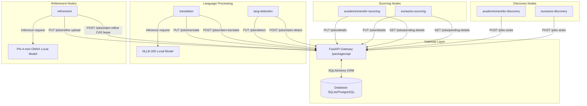

# Academic Job Sourcing & Refinement

A Python workspace to fetch, parse, and refine academic job listings from EURAXESS and AcademicTransfer.

---

## 1. Project Structure

```text
├── packages/
│   ├── core/                          # Shared models, repository, and HTTP client
│   ├── api/                           # FastAPI gateway server
│   └── agents/                        # Isolated worker packages
│       ├── euraxess-discovery/            # EURAXESS search pagination worker
│       ├── euraxess-sourcing/             # EURAXESS page details fetcher
│       ├── academictransfer-discovery/    # AcademicTransfer search pagination worker
│       ├── academictransfer-sourcing/     # AcademicTransfer page details fetcher
│       ├── lang-detection/                # Standalone local language detection worker
│       ├── translation/                   # Standalone local NLLB-200 translation worker
│       └── refinement/                    # Local ONNX model metadata refiner
├── pyproject.toml                     # Root workspace configuration
├── uv.lock                           # Workspace dependency lockfile
├── .env.example                       # Settings template file
└── Dockerfile                         # API gateway Dockerfile
```

---

## 2. Requirements

*   **Python**: `>= 3.11`
*   **Environment Manager**: [uv](https://github.com/astral-sh/uv) (recommended)
*   **Hardware requirements**:
    *   **Refinement Agent**: ~3GB RAM / VRAM to load the `phi-4-mini` ONNX model.
    *   **Translation Agent**: ~600MB RAM to load the quantized `NLLB-200-distilled-600M` model.
*   **Database**: SQLite (default local file `jobs.db`) or PostgreSQL (e.g., Neon).

---

## 3. Quick Start

### A. Configure Environment
Create a local `.env` file from the template:
```bash
cp .env.example .env
```
Edit the `.env` file to configure your credentials and database connection string.

### B. Install Dependencies
Synchronize the workspace:
```bash
uv sync --all-packages
```

### C. Start API Server
Run the FastAPI gateway server:
```bash
uv run --package api fastapi run packages/api/src/api/main.py --port 8000
```

---

## 4. Running Workspace Agents

All agents are run from the workspace root. Settings are loaded automatically from the `.env` file.
The agents are fully decoupled and communicate only with the central API gateway.

### Agents Catalog

| Agent Package | Main Module | Agent Role | Target Source |
| :--- | :--- | :--- | :--- |
| `euraxess-discovery` | `euraxess_discovery.main` | Discovery | EURAXESS |
| `academictransfer-discovery` | `academictransfer_discovery.main` | Discovery | AcademicTransfer |
| `euraxess-sourcing` | `euraxess_sourcing.main` | Sourcing | EURAXESS |
| `academictransfer-sourcing` | `academictransfer_sourcing.main` | Sourcing | AcademicTransfer |
| `lang-detection` | `agent_lang_detection.main` | Language Detection | (All Sources) |
| `translation` | `agent_translation.main` | Local Translation | (All Sources) |
| `refinement` | `agent_refinement.main` | Metadata Extraction | (All Sources) |

### Command Syntax
Run any agent by specifying its package and module:
```bash
uv run --package <Agent Package> python -m <Main Module>
```

*Example:*
```bash
uv run --package lang-detection python -m agent_lang_detection.main
```

---

## 5. Configuration Settings

Settings configured via the `.env` file:

| Environment Variable | Default Value | Description |
|---|---|---|
| `API_URL` | `http://localhost:8000` | Target URL of the FastAPI gateway |
| `API_TOKEN` | *None* | Bearer credential token |
| `API_SECRET_KEY` | *None* | Shared validation key (API Server only) |
| `DATABASE_URL` | `sqlite:///jobs.db` | SQL database connection string |
| `MAX_PAGES` | `5` | Pagination crawl depth |
| `MODEL_PATH` | `phi-4-mini-onnx/...` | Relative path to local ONNX model directory |
| `MAX_LENGTH` | `4096` | LLM maximum generation length |
| `TEMPERATURE` | `0.0` | Model generation temperature |
| `MAX_TEXT_CHARS` | `3000` | Max characters sent to context window |
| `AGENT_NAME` | `refinement-worker` | Custom agent identifier for locking |

---

## 6. System Architecture & Diagrams

### Data Flow
Discovery, sourcing, detection, translation, and refinement agents communicate only with the API server.



### Class Structures
Shared models and interfaces reside in the core package.


