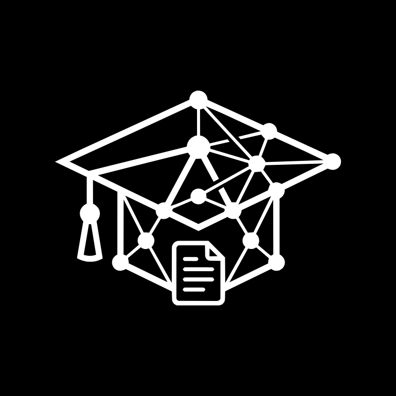
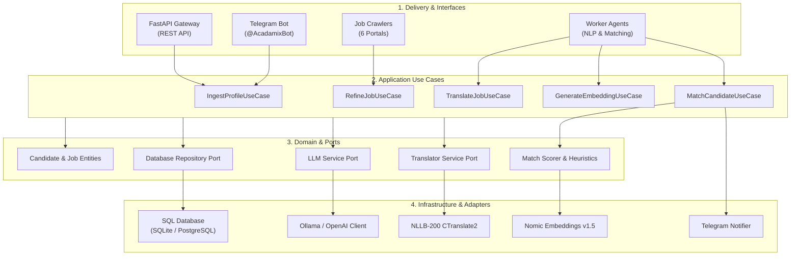

<p align="center">
  
</p>

<h1 align="center">Academix</h1>

<p align="center">
  <a href="https://t.me/AcadamixBot"></a>
  <a href="https://drlacheheb.github.io/academix"></a>
  <a href="https://ko-fi.com/drlacheheb"></a>
  <a href="https://academix-production-1c37.up.railway.app/status"></a>
  <a href="https://academix-production-1c37.up.railway.app/status"></a>
</p>

<p align="center">
  <em>An automated academic job sourcing, metadata refinement, and AI candidate matching engine. Connects researchers, postdocs, and PhD candidates with top global academic vacancies through real-time scraping, multilingual translation, vector similarity, and Telegram notifications.</em>
</p>

---

## What It Does

Finding the right academic position (PhD, Postdoc, or Faculty) across universities and research institutions worldwide is often fragmented across multiple national portals and languages. Academix automates the entire discovery, extraction, and matching workflow:

1. **Multi-Portal Discovery & Sourcing**: Continuously crawls 6 major academic job boards worldwide (EURAXESS, AcademicTransfer, ABG, NatureCareers, ResearchGate, and EuroScienceJobs).
2. **Multilingual NLP & Translation**: Paragraph-aware language detection (Lingua & OpenLID) and NLLB-200 translation for non-English academic vacancy listings.
3. **Structured CV Parsing**: Asynchronously extracts degrees, institutions, specialized technical skills, and research domains from uploaded candidate CVs (PDF).
4. **Hybrid Multi-Factor Matching**: Evaluates candidates using Nomic Embed v1.5 vector similarity, BM25 keyword matching, and prerequisite degree compatibility.
5. **Interactive Telegram Assistant (`@AcadamixBot`)**: Full candidate interface for CV uploading, progress tracking, single-card carousel job browsing, and instant match alerts.
6. **Unified Modular Architecture**: 20 decoupled microservices orchestrable via Docker Compose (CPU, GPU, or Postgres) or a single lightweight local runner.

---

## How It Works


```mermaid
graph TD
    subgraph Delivery ["1. Delivery & Interfaces"]
        API["FastAPI Gateway<br/>(REST API)"]
        Bot["Telegram Bot<br/>(@AcadamixBot)"]
        Crawlers["Job Crawlers<br/>(6 Portals)"]
        Workers["Worker Agents<br/>(NLP & Matching)"]
    end

    subgraph UseCases ["2. Application Use Cases"]
        IngestUC["IngestProfileUseCase"]
        RefineUC["RefineJobUseCase"]
        TransUC["TranslateJobUseCase"]
        EmbedUC["GenerateEmbeddingUseCase"]
        MatchUC["MatchCandidateUseCase"]
    end

    subgraph Domain ["3. Domain & Ports"]
        Entities["Candidate & Job Entities"]
        Scorer["Match Scorer & Heuristics"]
        RepoPort["Database Repository Port"]
        LLMPort["LLM Service Port"]
        TransPort["Translator Service Port"]
    end

    subgraph Infrastructure ["4. Infrastructure & Adapters"]
        DB["SQL Database<br/>(SQLite / PostgreSQL)"]
        LLM["Ollama / OpenAI Client"]
        NLLB["NLLB-200 CTranslate2"]
        Nomic["Nomic Embeddings v1.5"]
        Notifier["Telegram Notifier"]
    end

    API --> IngestUC
    Bot --> IngestUC
    Crawlers --> RefineUC
    Workers --> TransUC
    Workers --> EmbedUC
    Workers --> MatchUC

    UseCases --> Entities
    MatchUC --> Scorer

    UseCases --> RepoPort
    UseCases --> LLMPort
    UseCases --> TransPort

    RepoPort --> DB
    LLMPort --> LLM
    TransPort --> NLLB
    Scorer --> Nomic
    MatchUC --> Notifier
```

---

## Quick Start

### 1. Requirements
* Python >= 3.12
* [uv](https://github.com/astral-sh/uv) (recommended) or Docker & Docker Compose
* Local or remote OpenAI-compatible LLM service (e.g., [Ollama](https://ollama.com))

### 2. Setup Environment
Copy `.env.example` to `.env`:
```bash
cp .env.example .env
```

Configure your `.env` variables:
```ini
PORT=8000
API_SECRET_KEY=dev_secret_key
DATABASE_URL=sqlite:///data/academix.db
TELEGRAM_BOT_TOKEN=your_token_from_botfather

# LLM & Embedding Settings
LLM_SERVICE_URL=http://localhost:11434/v1
LLM_MODEL=hf.co/unsloth/gemma-4-E2B-it-GGUF:gemma-4-E2B-it-Q3_K_M.gguf
EMBEDDING_MODEL=nomic-ai/nomic-embed-text-v1.5
MATCH_THRESHOLD=0.75
DEGREE_SIMILARITY_THRESHOLD=0.71
ENABLE_MATCH_EXPLANATION=true
```

> **Telegram Bot Ready**: Set `TELEGRAM_BOT_TOKEN` to enable real-time CV matching and instant vacancy alerts directly inside Telegram via `@AcadamixBot`.

### 3. Install Dependencies
```bash
uv sync --all-packages
```

### 4. Setup Database
Run database schema migrations:
```bash
uv run python -m core.infrastructure.db.run_migrations
```
*(Supports SQLite local file or PostgreSQL server)*

### 5. Run the Project (Unified Local Server)
```bash
uv run python run_all.py
```
This starts the FastAPI gateway, Telegram bot, background NLP workers, and all crawler agents under a unified supervisor process.

### 6. Run with Docker Compose (Alternative)

* **Default CPU Stack** (Gateway + Workers + Crawlers):
```bash
docker compose up --build -d
```

* **GPU Mode** (Hardware accelerated inference):
```bash
docker compose -f docker-compose.yml -f docker-compose.gpu.yml up --build -d
```

* **Production Stack with PostgreSQL & NGINX**:
```bash
docker compose -f docker-compose.yml -f docker-compose.postgres.yml -f docker-compose.prod.yml up --build -d
```

---

## Telegram Bot Usage (`@AcadamixBot`)

* `/start` - Starts the assistant or opens the personal dashboard.
* `/upload_cv` - Step-by-step prompt to upload your academic CV (PDF).
* `/status` - Visual progress bar tracking CV extraction, translation, and matching.
* `/profile` - View extracted skills, highest degree, and research domains.
* `/edit` - Interactive button wizard to edit skills, research domains, or degree fields.
* `/matches` - Single-card carousel to browse matched academic vacancies with direct links.
* `/delete` - Reset and permanently delete your profile and CV document.
* `/help` - Command guide and usage instructions.

### Candidate Workflow
1. Start a conversation with `@AcadamixBot` and tap **Upload CV** or send `/upload_cv`.
2. Attach and send your CV as a `.pdf` file.
3. The AI pipeline parses your qualifications and calculates semantic compatibility against open European vacancies.
4. When matches are computed, receive instant notifications with match percentage, job details, and direct links to apply.

---

## API Endpoints

### 1. Ingest Candidate CV
`POST /profiles/upload-cv`
* Uploads a candidate's CV document (PDF format) and queues asynchronous parsing.
```bash
curl -X POST http://localhost:8000/profiles/upload-cv \
  -F "file=@/path/to/cv.pdf" \
  -F "name=Marie Curie" \
  -F "telegram_chat_id=123456789"
```

### 2. Retrieve Matched Vacancies
`GET /profiles/{profile_id}/matches?limit=10`
* Returns ranked academic positions meeting compatibility thresholds with optional LLM reasoning explanation.

### 3. Retrieve Refined Jobs
`GET /jobs/refined`
* Returns structured academic vacancies enriched with prerequisite degree levels, fields, and deadlines.

### 4. Health & Status Check
`GET /status` or `GET /health`
* Checks service health and database connectivity.

---

## Code Quality & Testing

* **Lint with Ruff:**
```bash
uv run ruff check .
```

* **Format code with Ruff:**
```bash
uv run ruff format .
```

* **Run complete test suite:**
```bash
uv run pytest
```

---

## Support the Project

If you find Academix useful in your academic job search or research workflow, consider supporting its open-source development:

<p align="left">
  <a href="https://ko-fi.com/drlacheheb" target="_blank" rel="noopener noreferrer">
    
  </a>
</p>

* Every coffee helps cover server hosting costs, multi-portal crawler infrastructure, and ongoing maintenance.

---

## License

This project is licensed under the **Business Source License 1.1 (BSL 1.1)**.

* **Free for Personal & Educational Use**: You are free to view, study, modify, and run Academix for personal, academic, research, and non-commercial purposes.
* **Commercial Protection**: Offering Academix as a commercial matching service or SaaS to third parties requires a commercial license.
* **Conversion**: Automatically converts to open-source **GNU General Public License v3.0 (GPLv3)** after the change date.

See the [LICENSE](LICENSE) file for complete legal terms.
