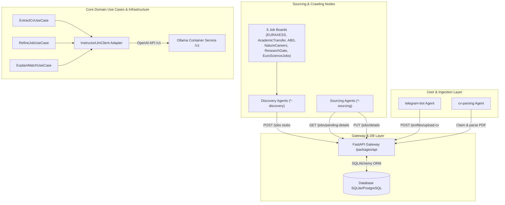

# Academic Job Sourcing & Refinement

Automated academic job sourcing, metadata refinement, and CV matching pipeline. Uses local, high-performance models (SentenceTransformers, NLLB-200, and Ollama with instructor) to translate, detect languages, extract structured skills, prerequisite degrees, and match candidates against positions.

---

## 1. Project Structure

```text
├── packages/
│   ├── core/                          # Shared domain models, DB repositories, Use Cases, & Instructor LLM Client
│   │   └── src/core/usecases/         # Domain use case experts (ExtractCvUseCase, RefineJobUseCase, ExplainMatchUseCase)
│   ├── api/                           # FastAPI gateway server and database coordinator
│   └── agents/                        # Isolated worker packages running in parallel
│       ├── euraxess-discovery/            # EURAXESS search pagination discovery agent
│       ├── euraxess-sourcing/             # EURAXESS page details fetcher agent
│       ├── academictransfer-discovery/    # AcademicTransfer search pagination discovery agent
│       ├── academictransfer-sourcing/     # AcademicTransfer page details fetcher agent
│       ├── abg-discovery/                 # ABG L'Intelli'agence discovery agent
│       ├── abg-sourcing/                  # ABG L'Intelli'agence page details fetcher agent
│       ├── naturecareers-discovery/       # Nature Careers search pagination discovery agent
│       ├── naturecareers-sourcing/        # Nature Careers page details fetcher agent
│       ├── researchgate-discovery/        # ResearchGate search pagination discovery agent
│       ├── researchgate-sourcing/         # ResearchGate page details fetcher agent
│       ├── eurosciencejobs-discovery/     # EuroScienceJobs search pagination discovery agent
│       ├── eurosciencejobs-sourcing/      # EuroScienceJobs page details fetcher agent
│       ├── lang-detection/                # Standalone local language detection agent
│       ├── translation/                   # Standalone local NLLB-200 translation agent
│       ├── refinement/                    # Metadata refinement worker (Ollama + instructor)
│       ├── embedding-worker/              # Dedicated nomic vector embedding generation agent
│       ├── matching/                      # Candidate CV matching & LLM explanation agent
│       ├── cv-parsing/                    # Background CV ingest and layout parsing agent
│       └── telegram-bot/                  # Telegram Bot candidate interaction interface agent
├── pyproject.toml                     # Root workspace configuration
├── uv.lock                           # Workspace dependency lockfile
├── .env.example                       # Settings template file
├── Dockerfile                         # Unified multi-purpose Dockerfile
├── docker-compose.yml                 # Unified Docker Compose orchestration config (CPU default)
├── docker-compose.gpu.yml             # Optional NVIDIA GPU hardware reservation override
├── docker-compose.override.yml        # Dev-mode port mapping override
├── docker-compose.prod.yml            # Production scaled mode with NGINX
└── nginx.conf                         # NGINX reverse proxy config
```

---

## 2. Requirements

*   **Docker & Docker Compose** (recommended for unified execution)
*   **Python**: `== 3.12.*` (if running locally without containers)
*   **Environment Manager**: [uv](https://github.com/astral-sh/uv) (for local workspace CLI runs)
*   **Hardware requirements**:
    *   **LLM Service (Ollama)**: Centralized Ollama container running `gemma4` (or any model configured via `LLM_MODEL`).
    *   **Translation Agent**: ~600MB RAM to load the quantized `NLLB-200-distilled-600M` model.
    *   **Matching Agent**: Uses `nomic-embed-text-v1.5` for vector similarities and delegates structured reasoning to Ollama via `InstructorLlmClient`.
*   **Database**: SQLite (default local file `jobs.db` mounted in containers) or PostgreSQL.

---

## 3. Quick Start with Docker Compose (Recommended)

Running the entire stack (API server + crawlers + NLP workers + Ollama) takes a single command:

### A. Configure Environment
Create your local `.env` file from the template:
```bash
cp .env.example .env
```

### B. Boot the Stack

#### 1. CPU Mode (Default - Works out-of-the-box on any machine)
```bash
docker compose up --build -d
```

#### 2. GPU Mode (NVIDIA Hardware Acceleration)
If you have an NVIDIA GPU and NVIDIA Container Toolkit installed:
```bash
docker compose -f docker-compose.yml -f docker-compose.gpu.yml up --build -d
```
*Tip: Set `COMPOSE_FILE=docker-compose.yml:docker-compose.gpu.yml` in `.env` to enable GPU mode automatically with standard `docker compose up`.*

#### 3. Production Scaled Mode (Behind NGINX Load Balancer)
```bash
docker compose -f docker-compose.yml -f docker-compose.prod.yml up --build -d --scale api=3
```

### C. Graceful Terminations
To stop the stack cleanly:
```bash
docker compose down
```

---

## 4. Running Locally with UV (Development Mode)

Synchronize your workspace dependencies first:
```bash
uv sync --all-packages
```

### A. Start API Server
Run the FastAPI gateway server:
```bash
uv run --package api fastapi run packages/api/src/api/main.py --port 8000
```

### B. Run Workspace Agents

| Agent Package | Main Module | Agent Role |
| :--- | :--- | :--- |
| `euraxess-discovery` | `euraxess_discovery.main` | Pagination crawl discovery (EURAXESS) |
| `euraxess-sourcing` | `euraxess_sourcing.main` | Page details fetcher (EURAXESS) |
| `academictransfer-discovery` | `academictransfer_discovery.main` | Pagination crawl discovery (AcademicTransfer) |
| `academictransfer-sourcing` | `academictransfer_sourcing.main` | Page details fetcher (AcademicTransfer) |
| `abg-discovery` | `abg_discovery.main` | Pagination crawl discovery (ABG) |
| `abg-sourcing` | `abg_sourcing.main` | Page details fetcher (ABG) |
| `naturecareers-discovery` | `naturecareers_discovery.main` | Pagination crawl discovery (Nature Careers) |
| `naturecareers-sourcing` | `naturecareers_sourcing.main` | Page details fetcher (Nature Careers) |
| `researchgate-discovery` | `researchgate_discovery.main` | Pagination crawl discovery (ResearchGate) |
| `researchgate-sourcing` | `researchgate_sourcing.main` | Page details fetcher (ResearchGate) |
| `eurosciencejobs-discovery` | `eurosciencejobs_discovery.main` | Pagination crawl discovery (EuroScienceJobs) |
| `eurosciencejobs-sourcing` | `eurosciencejobs_sourcing.main` | Page details fetcher (EuroScienceJobs) |
| `lang-detection` | `agent_lang_detection.main` | Language Detection (All Sources) |
| `translation` | `agent_translation.main` | Local NLLB-200 Translation (All Sources) |
| `refinement` | `agent_refinement.main` | Skills & Metadata Refinement Worker |
| `embedding-worker` | `agent_embedding.main` | Local Nomic Vector Embeddings |
| `matching` | `agent_matching.main` | Candidate CV Matcher & Explainer |
| `cv-parsing` | `agent_cv_parsing.main` | Background CV Ingest and Layout Parsing |
| `telegram-bot` | `telegram_bot.main` | Telegram Bot User Interface Agent |

Run any agent using:
```bash
uv run --package <Agent Package> python -m <Main Module>
```

---

## 5. Core API & Pipeline Workflow

### A. Ingest a Candidate CV
Upload a candidate's CV (PDF format). The API saves the file and queues it for asynchronous parsing, language detection, translation, and structured field extraction:
```bash
curl -X POST http://localhost:8000/profiles/upload-cv \
  -H "Authorization: Bearer dev_secret_key" \
  -F "file=@/path/to/cv.pdf" \
  -F "email=candidate@example.com" \
  -F "name=John Doe"
```

### B. Retrieve Matched Jobs & Explanations
Retrieve a list of qualified academic positions for a candidate (ranked by vector similarity with LLM-generated explanations):
```bash
curl -X GET http://localhost:8000/profiles/1/matches?limit=10 \
  -H "Authorization: Bearer dev_secret_key"
```

---

## 6. Configuration Settings

Key `.env` options:

| Environment Variable | Default Value | Description |
|---|---|---|
| `API_URL` | `http://localhost:8000` | Target URL of the FastAPI gateway |
| `API_SECRET_KEY` | *None* | Shared bearer credential and API validation key |
| `DATABASE_URL` | `sqlite:///jobs.db` | SQL database connection string |
| `LLM_SERVICE_URL` | `http://ollama:11434/v1` | OpenAI-compatible endpoint for Ollama service |
| `LLM_MODEL` | `hf.co/unsloth/gemma-4-E2B-it-GGUF:Q4_K_M` | Target model name |
| `EMBEDDING_MODEL` | `nomic-ai/nomic-embed-text-v1.5` | Target SentenceTransformer embedding model |
| `MATCH_THRESHOLD` | `0.7` | Minimum score threshold for candidate-job match |
| `STORAGE_PROVIDER` | `local` | Storage backend: `local` filesystem or `s3` |

---

## 7. System Architecture (Clean Architecture)


```mermaid
graph TD
    subgraph Sourcing & Crawling Nodes
        Sources["6 Job Boards<br/>(EURAXESS, AcademicTransfer, ABG,<br/>NatureCareers, ResearchGate, EuroScienceJobs)"]
        Disc["Discovery Agents (*-discovery)"]
        Sourc["Sourcing Agents (*-sourcing)"]
    end

    subgraph User & Ingestion Layer
        TG[telegram-bot Agent]
        CV[cv-parsing Agent]
    end

    subgraph Gateway & DB Layer
        API[FastAPI Gateway /packages/api]
        DB[(Database SQLite/PostgreSQL)]
    end

    subgraph Core Domain Use Cases & Infrastructure
        ExtractCV[ExtractCvUseCase]
        RefineJob[RefineJobUseCase]
        ExplainMatch[ExplainMatchUseCase]
        InstructorClient[InstructorLlmClient Adapter]
        Ollama[Ollama Container Service /v1]
    end

    Sources --> Disc
    Disc -->|POST /jobs stubs| API
    Sourc -->|GET /jobs/pending-details| API
    Sourc -->|PUT /jobs/details| API

    TG -->|POST /profiles/upload-cv| API
    CV -->|Claim & parse PDF| API

    ExtractCV --> InstructorClient
    RefineJob --> InstructorClient
    ExplainMatch --> InstructorClient
    InstructorClient -->|OpenAI API /v1| Ollama

    API <-->|SQLAlchemy ORM| DB
```

---

## 8. Code Quality & Verification

Ensure all linting and static type checks pass cleanly before committing code:

### A. Code Formatting & Linting (Ruff)
```bash
uv run ruff check .
uv run ruff format .
```

### B. Static Type Checking (Pyright)
```bash
uv run pyright .
```

### C. Database Schema Migrations (Alembic)
```bash
uv run --package api alembic -c packages/api/alembic.ini revision --autogenerate -m "describe_your_change"
```
