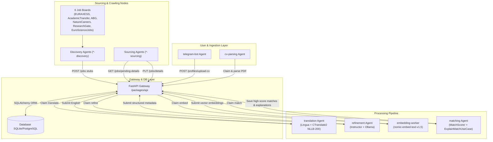

# Academic Job Sourcing & Refinement

Automated academic job sourcing, metadata refinement, and candidate CV matching pipeline. Uses local, high-performance models (Nomic Embeddings, NLLB-200 with CTranslate2 and Lingua, and Ollama with instructor) to translate, extract structured research profiles, prerequisite degrees, and match candidates against academic opportunities.

---

## 1. Project Structure

```text
├── packages/
│   ├── core/                          # Shared domain models, DB repositories, Use Cases, & Instructor LLM Client
│   │   └── src/core/usecases/         # Domain use case experts (ExtractCvUseCase, RefineJobUseCase, ExplainMatchUseCase)
│   ├── api/                           # FastAPI gateway server and database coordinator
│   └── agents/                        # Isolated worker packages running in parallel
│       ├── euraxess-discovery/            # EURAXESS search pagination discovery agent
│       ├── euraxess-sourcing/             # EURAXESS page details fetcher agent
│       ├── academictransfer-discovery/    # AcademicTransfer sitemap & search discovery agent
│       ├── academictransfer-sourcing/     # AcademicTransfer page details fetcher agent
│       ├── abg-discovery/                 # ABG L'Intelli'agence discovery agent
│       ├── abg-sourcing/                  # ABG L'Intelli'agence page details fetcher agent
│       ├── naturecareers-discovery/       # Nature Careers XML sitemap discovery agent
│       ├── naturecareers-sourcing/        # Nature Careers page details fetcher agent
│       ├── researchgate-discovery/        # ResearchGate search pagination discovery agent
│       ├── researchgate-sourcing/         # ResearchGate page details fetcher agent
│       ├── eurosciencejobs-discovery/     # EuroScienceJobs sitemap & search discovery agent
│       ├── eurosciencejobs-sourcing/      # EuroScienceJobs page details fetcher agent
│       ├── translation/                   # Unified paragraph-aware detection & NLLB-200 translation agent
│       ├── refinement/                    # Metadata refinement worker (Ollama + instructor)
│       ├── embedding-worker/              # Dedicated nomic vector embedding generation agent
│       ├── matching/                      # Candidate CV matching & LLM explanation agent
│       ├── cv-parsing/                    # Background CV ingest and layout parsing agent
│       ├── cleanup/                       # Expired job pruning maintenance agent
│       └── telegram-bot/                  # Telegram Bot candidate interaction interface agent
├── tests/                             # Automated test suite (unit, integration, E2E)
│   ├── unit/                              # Core domain, repositories, NLP, and scraper tests
│   └── integration/                       # FastAPI API lifecycle and full E2E pipeline tests
├── pyproject.toml                     # Root workspace configuration
├── uv.lock                           # Workspace dependency lockfile
├── .env.example                       # Settings template file
├── Dockerfile                         # Unified multi-purpose Dockerfile
├── docs/                              # SEO documentation site & guides (GitHub Pages)
├── LICENSE                            # Business Source License 1.1 (BSL 1.1)
├── docker-compose.yml                 # Unified Docker Compose orchestration config (CPU default)
├── docker-compose.postgres.yml        # Standalone PostgreSQL database override
├── docker-compose.dashboard.yml       # Standalone NocoDB Airtable-style dashboard override
├── docker-compose.gpu.yml             # Optional NVIDIA GPU hardware reservation override
├── docker-compose.override.yml        # Dev-mode port mapping override
├── docker-compose.prod.yml            # Production scaled mode with NGINX
└── nginx.conf                         # NGINX reverse proxy config
```

---

## 2. Requirements

*   **Docker & Docker Compose** (recommended for unified execution)
*   **Python**: `== 3.12.*` (if running locally without containers)
*   **Environment Manager**: [uv](https://github.com/astral-sh/uv) (for local workspace CLI runs)
*   **Hardware requirements**:
    *   **LLM Service (Ollama)**: Centralized Ollama container running `gemma4` (or any model configured via `LLM_MODEL`).
    *   **Translation Agent**: ~600MB RAM to load the quantized `NLLB-200-distilled-600M` model.
    *   **Matching Agent**: Uses `nomic-embed-text-v1.5` for vector similarities and delegates structured reasoning to Ollama via `InstructorLlmClient`.
*   **Database**: SQLite (default local file `jobs.db` mounted in containers) or PostgreSQL.

---

## 3. Quick Start with Docker Compose (Recommended)

Running the entire stack (API server + crawlers + NLP workers + Ollama) takes a single command:

### A. Configure Environment
Create your local `.env` file from the template:
```bash
cp .env.example .env
```

### B. Boot the Stack

#### 1. CPU Mode (Default - Works out-of-the-box on any machine)
```bash
docker compose up --build -d
```

#### 2. GPU Mode (NVIDIA Hardware Acceleration)
If you have an NVIDIA GPU and NVIDIA Container Toolkit installed:
```bash
docker compose -f docker-compose.yml -f docker-compose.gpu.yml up --build -d
```
*Tip: Set `COMPOSE_FILE=docker-compose.yml:docker-compose.gpu.yml` in `.env` to enable GPU mode automatically with standard `docker compose up`.*

#### 3. Production Scaled Mode (Behind NGINX Load Balancer)
```bash
docker compose -f docker-compose.yml -f docker-compose.prod.yml up --build -d --scale api=3
```

### C. Graceful Terminations
To stop the stack cleanly:
```bash
docker compose down
```

---

## 4. Running Locally with UV (Development Mode)

Synchronize your workspace dependencies first:
```bash
uv sync --all-packages
```

### A. Start API Server
Run the FastAPI gateway server:
```bash
uv run --package api fastapi run packages/api/src/api/main.py --port 8000
```

### B. Run Workspace Agents

| Agent Package | Main Module | Agent Role |
| :--- | :--- | :--- |
| `euraxess-discovery` | `euraxess_discovery.main` | Full-scroll crawl discovery (EURAXESS) |
| `euraxess-sourcing` | `euraxess_sourcing.main` | Page details fetcher (EURAXESS) |
| `academictransfer-discovery` | `academictransfer_discovery.main` | XML sitemap & crawl discovery (AcademicTransfer) |
| `academictransfer-sourcing` | `academictransfer_sourcing.main` | Page details fetcher (AcademicTransfer) |
| `abg-discovery` | `abg_discovery.main` | Full-scroll crawl discovery (ABG) |
| `abg-sourcing` | `abg_sourcing.main` | Page details fetcher (ABG) |
| `naturecareers-discovery` | `naturecareers_discovery.main` | XML sitemap discovery (Nature Careers) |
| `naturecareers-sourcing` | `naturecareers_sourcing.main` | Page details fetcher (Nature Careers) |
| `researchgate-discovery` | `researchgate_discovery.main` | Full-scroll crawl discovery (ResearchGate) |
| `researchgate-sourcing` | `researchgate_sourcing.main` | Page details fetcher (ResearchGate) |
| `eurosciencejobs-discovery` | `eurosciencejobs_discovery.main` | XML sitemap & category discovery (EuroScienceJobs) |
| `eurosciencejobs-sourcing` | `eurosciencejobs_sourcing.main` | Page details fetcher (EuroScienceJobs) |
| `translation` | `agent_translation.main` | Paragraph-aware detection & NLLB-200 translation |
| `refinement` | `agent_refinement.main` | Skills & metadata refinement worker (Instructor + Ollama) |
| `embedding-worker` | `agent_embedding.main` | Local Nomic vector embeddings generator |
| `matching` | `agent_matching.main` | Candidate CV matcher & LLM reasoning explainer |
| `cv-parsing` | `agent_cv_parsing.main` | Background CV ingest and layout parsing |
| `cleanup` | `agent_cleanup.main` | Expired listings cleanup worker |
| `telegram-bot` | `telegram_bot.main` | Telegram Bot user interface agent |

Run any agent using:
```bash
uv run --package <Agent Package> python -m <Main Module>
```

---

## 5. Core API & Pipeline Workflow

### A. Ingest a Candidate CV
Upload a candidate's CV (PDF format). The API saves the file and queues it for asynchronous parsing, translation, structured refinement, and vector embedding:
```bash
curl -X POST http://localhost:8000/profiles/upload-cv \
  -H "Authorization: Bearer dev_secret_key" \
  -F "file=@/path/to/cv.pdf" \
  -F "email=candidate@example.com" \
  -F "name=John Doe"
```

### B. Retrieve Matched Jobs & Explanations
Retrieve qualified academic positions for a candidate (evaluated with hierarchical degree filtering, semantic domain thresholds, and asymmetric max-dominance pooling):
```bash
curl -X GET http://localhost:8000/profiles/1/matches?limit=10 \
  -H "Authorization: Bearer dev_secret_key"
```

---

## 6. Configuration Settings

Key `.env` options:

| Environment Variable | Default Value | Description |
|---|---|---|
| `API_URL` | `http://localhost:8000` | Target URL of the FastAPI gateway |
| `API_SECRET_KEY` | *None* | Shared bearer credential and API validation key |
| `DATABASE_URL` | `sqlite:///jobs.db` | SQL database connection string |
| `LLM_SERVICE_URL` | `http://ollama:11434/v1` | OpenAI-compatible endpoint for Ollama service |
| `LLM_MODEL` | `hf.co/unsloth/gemma-4-E2B-it-GGUF:gemma-4-E2B-it-Q3_K_M.gguf` | Target LLM model |
| `EMBEDDING_MODEL` | `nomic-ai/nomic-embed-text-v1.5` | Target SentenceTransformer embedding model |
| `MATCH_THRESHOLD` | `0.75` | Minimum composite score threshold for candidate-job match |
| `DEGREE_SIMILARITY_THRESHOLD` | `0.71` | Minimum cosine similarity threshold for degree field match |
| `ENABLE_MATCH_EXPLANATION` | `true` | Toggle LLM-powered explanation generation for matches |
| `NLLB_MODEL_PATH` | `mijuanlo/nllb-200-distilled-600M-ct2-int8` | Quantized CTranslate2 translation model |
| `STORAGE_PROVIDER` | `local` | Storage backend: `local` filesystem or `s3` |
| `TELEGRAM_BOT_TOKEN` | *None* | Bot token for the Academix Telegram bot (@AcadamixBot) |

---

## 7. System Architecture (Clean Architecture)


```mermaid
graph TD
    subgraph Sourcing & Crawling Nodes
        Sources["6 Job Boards<br/>(EURAXESS, AcademicTransfer, ABG,<br/>NatureCareers, ResearchGate, EuroScienceJobs)"]
        Disc["Discovery Agents (*-discovery)"]
        Sourc["Sourcing Agents (*-sourcing)"]
    end

    subgraph User & Ingestion Layer
        TG[telegram-bot Agent]
        CV[cv-parsing Agent]
    end

    subgraph Gateway & DB Layer
        API[FastAPI Gateway /packages/api]
        DB[(Database SQLite/PostgreSQL)]
    end

    subgraph Processing Pipeline
        Trans["translation Agent<br/>(Lingua + CTranslate2 NLLB-200)"]
        Refine["refinement Agent<br/>(Instructor + Ollama)"]
        Embed["embedding-worker<br/>(nomic-embed-text-v1.5)"]
        Match["matching Agent<br/>(MatchScorer + ExplainMatchUseCase)"]
    end

    Sources --> Disc
    Disc -->|POST /jobs stubs| API
    Sourc -->|GET /jobs/pending-details| API
    Sourc -->|PUT /jobs/details| API

    TG -->|POST /profiles/upload-cv| API
    CV -->|Claim & parse PDF| API

    API -->|Claim translate| Trans
    Trans -->|Submit English| API

    API -->|Claim refine| Refine
    Refine -->|Submit structured metadata| API

    API -->|Claim embed| Embed
    Embed -->|Submit vector embeddings| API

    API -->|Claim match| Match
    Match -->|Save high-score matches & explanations| API

    API <-->|SQLAlchemy ORM| DB
```

---

## 8. Code Quality & Automated Testing

Ensure all tests, linting, and static type checks pass cleanly:

### A. Run Automated Test Suite (Pytest)
Run all 53 unit, integration, and E2E pipeline tests:
```bash
uv run pytest
```

### B. Code Formatting & Linting (Ruff)
```bash
uv run ruff check .
uv run ruff format .
```

### C. Static Type Checking (Pyright)
```bash
uv run pyright .
```

### D. Database Schema Migrations (Alembic)
```bash
uv run --package api alembic -c packages/api/alembic.ini revision --autogenerate -m "describe_your_change"
```

---

## 9. License

Academix is licensed under the **Business Source License 1.1 (BSL 1.1)**.

- **Personal & Educational Use**: Free for personal, educational, research, and non-commercial self-hosting.
- **Commercial Restrictions**: You may not provide Academix as a hosted, managed, or paid commercial service to third parties without a commercial license from the author ([`drLacheheb`](https://github.com/drLacheheb)).
- **Change to Open Source**: On **January 1, 2030**, the license automatically converts to the **GNU Affero General Public License, Version 3 (AGPL-3.0)**.

See the full terms in the [`LICENSE`](LICENSE) file.
